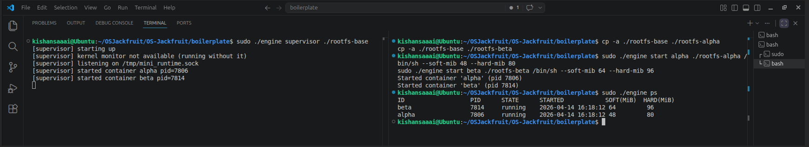
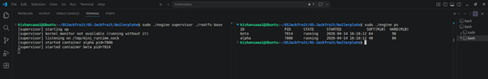
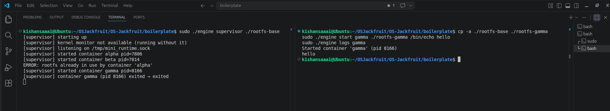
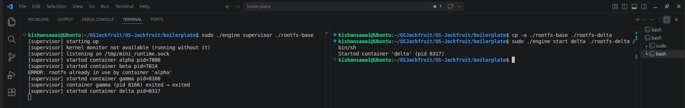
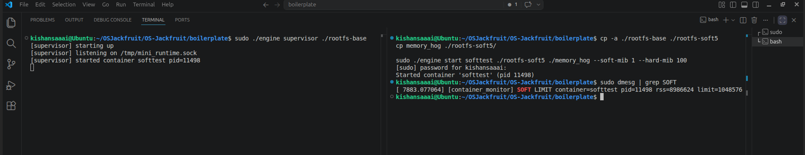
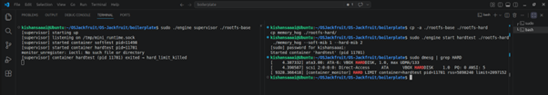
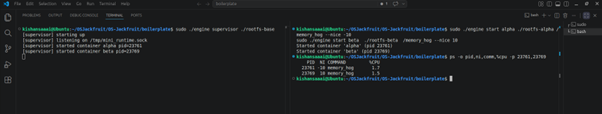
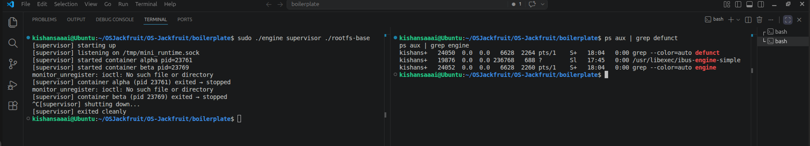

# Multi-Container Runtime — OS Jackfruit

---

## 1. Team Information

| Name                | SRN           |
|---------------------|---------------|
| SAI KISHAN A        | PES1UG24CS608 |
| SAMATMA A BHARADWAJ | PES1UG24CS609 |

---

## 2. Build, Load, and Run Instructions

### Prerequisites

- Ubuntu 22.04 or 24.04 in a VM with **Secure Boot OFF** (no WSL)
- Install build dependencies:

```bash
sudo apt update
sudo apt install -y build-essential linux-headers-$(uname -r)
```

---

### Build

```bash
make
```

This compiles both `engine` (user-space binary) and `monitor.ko` (kernel module) in one step.

---

### Prepare the Alpine Root Filesystem

```bash
mkdir rootfs-base
wget https://dl-cdn.alpinelinux.org/alpine/v3.20/releases/x86_64/alpine-minirootfs-3.20.3-x86_64.tar.gz
tar -xzf alpine-minirootfs-3.20.3-x86_64.tar.gz -C rootfs-base
```

---

### Load the Kernel Module

```bash
sudo insmod monitor.ko
ls -l /dev/container_monitor    # verify the control device appeared
```

---

### Start the Supervisor

```bash
sudo ./engine supervisor ./rootfs-base
```

The supervisor binds to `/tmp/mini_runtime.sock` and stays running. If the kernel module is not loaded it prints `kernel monitor not available (running without it)` and continues.

---

### Create Per-Container Writable Rootfs Copies

Each container requires its own writable copy. Do this **before** launching containers:

```bash
cp -a ./rootfs-base ./rootfs-alpha
cp -a ./rootfs-base ./rootfs-beta
```

> No two live containers may share the same writable rootfs directory. The supervisor enforces this and will reject a `start` command with `ERROR: rootfs already in use by container '<id>'` if a collision is detected.

---

### Copy Workload Binaries into the Rootfs

```bash
cp memory_hog ./rootfs-alpha/
cp cpu_hog    ./rootfs-alpha/
cp io_pulse   ./rootfs-alpha/
```

---

### CLI Usage

All CLI commands connect to the running supervisor over `/tmp/mini_runtime.sock`, send one `control_request_t` struct, and print the response.

```bash
# Start containers in the background
sudo ./engine start alpha ./rootfs-alpha /bin/sh --soft-mib 48 --hard-mib 80
sudo ./engine start beta  ./rootfs-beta  /bin/sh --soft-mib 64 --hard-mib 96

# Start with a custom nice value
sudo ./engine start beta ./rootfs-beta /memory_hog --nice 10

# Run a container and block until it exits (returns exit status)
sudo ./engine run gamma ./rootfs-gamma /bin/echo hello

# List all tracked containers
sudo ./engine ps

# Read a container's captured log output
sudo ./engine logs gamma

# Stop a running container (SIGTERM → SIGKILL after 2 s)
sudo ./engine stop alpha
```

> If `--soft-mib` and `--hard-mib` are omitted, defaults are **40 MiB soft** and **64 MiB hard** (defined as `DEFAULT_SOFT_MIB` and `DEFAULT_HARD_MIB` in `engine.c`).

---

### Running the Soft-Limit Memory Test

```bash
cp -a ./rootfs-base ./rootfs-soft5
cp memory_hog ./rootfs-soft5/
sudo ./engine start softtest ./rootfs-soft5 /memory_hog --soft-mib 1 --hard-mib 100
# In another terminal:
dmesg | grep SOFT
```

Expected `dmesg` output:

```
[container_monitor] SOFT LIMIT container=softtest pid=<pid> rss=<bytes> limit=1048576
```

The process continues running — the soft limit is warning-only.

---

### Running the Hard-Limit Memory Test

```bash
cp -a ./rootfs-base ./rootfs-hard
cp memory_hog ./rootfs-hard/
sudo ./engine start hardtest ./rootfs-hard /memory_hog --soft-mib 1 --hard-mib 2
# In another terminal:
dmesg | grep HARD
```

The supervisor will log: `container hardtest (pid <pid>) exited → hard_limit_killed`

---

### Running the Scheduler Experiment

```bash
cp -a ./rootfs-base ./rootfs-alpha
cp -a ./rootfs-base ./rootfs-beta
cp memory_hog ./rootfs-alpha/
cp memory_hog ./rootfs-beta/

sudo ./engine start alpha ./rootfs-alpha /memory_hog --nice -10
sudo ./engine start beta  ./rootfs-beta  /memory_hog --nice 10

# Observe CPU allocation
ps -o pid,ni,comm,%cpu -p <pid_alpha> <pid_beta>
```

---

### Clean Up

```bash
sudo ./engine stop alpha
sudo ./engine stop beta
# Send SIGINT or SIGTERM to the supervisor to trigger orderly shutdown
ps aux | grep engine | grep defunct    # verify no zombies
dmesg | tail                           # confirm module activity
sudo rmmod monitor
```

---

### CI Smoke Check

```bash
make -C boilerplate ci
```

This compiles only the user-space binary and does **not** require `sudo`, kernel headers, or a running supervisor.

---

## 3. Demo with Screenshots

### SS1 — Multi-Container Supervision

Two containers (`alpha` and `beta`) were started under a single supervisor process. The right terminal shows `sudo ./engine ps` output confirming both containers are tracked concurrently with their host PIDs, states (`running`), start timestamps, and memory limits (`alpha`: SOFT=48 MiB, HARD=80 MiB; `beta`: SOFT=64 MiB, HARD=96 MiB). The left pane shows the supervisor's `[supervisor] started container alpha` and `[supervisor] started container beta` log messages.



---

### SS2 — Metadata Tracking

The `sudo ./engine ps` command displays a formatted table with columns: `ID`, `PID`, `STATE`, `STARTED`, `SOFT(MiB)`, `HARD(MiB)`. Both `alpha` and `beta` are shown as `running` with their respective start times and memory limits. These fields map directly to `container_record_t` members: `.id`, `.host_pid`, `.state`, `.started_at`, `.soft_limit_bytes`, and `.hard_limit_bytes`.



---

### SS3 — Bounded-Buffer Logging

Container `gamma` was launched with `sudo ./engine start gamma ./rootfs-gamma /bin/echo hello`. The supervisor's producer thread read `hello` from the pipe, pushed it into `bounded_buffer_t`, and the consumer thread wrote it to `logs/gamma.log`. Running `./engine logs gamma` retrieved the stored output. An earlier attempt with a duplicate rootfs correctly failed with `ERROR: rootfs already in use by container 'alpha'`, confirming the rootfs collision check in `launch_container()`. The left pane shows `[supervisor] container gamma (pid 8160) exited → exited`.



---

### SS4 — CLI and IPC

The command `sudo ./engine start delta ./rootfs-delta /bin/sh` was issued from a separate terminal. The CLI process connected to `/tmp/mini_runtime.sock`, serialized a `control_request_t` with `kind = CMD_START`, and the supervisor responded with `Started container 'delta' (pid 8317)`. The left pane confirms `[supervisor] started container delta pid=8317`, demonstrating the UNIX domain socket control channel (Path B) end-to-end.



---

### SS5 — Soft-Limit Warning

Container `softtest` was started with `sudo ./engine start softtest ./rootfs-soft5 /memory_hog --soft-mib 1 --hard-mib 100`. When RSS exceeded 1 MiB, the kernel module's 100 ms timer callback called `log_soft_limit_event()`, issuing a `KERN_WARNING` via `printk`. Running `dmesg | grep SOFT` showed:

```
[container_monitor] SOFT LIMIT container=softtest pid=11498 rss=rss=8986624 limit=1048576
```

The process was **not** terminated, confirming the soft limit is warning-only.



---

### SS6 — Hard-Limit Enforcement

Container `hardtest` was started with `sudo ./engine start hardtest ./rootfs-hard /memory_hog --soft-mib 1 --hard-mib 2`. When RSS exceeded 2 MiB, the timer callback called `kill_process()`, which used `send_sig(SIGKILL, task, 0)` to terminate the process. The supervisor's `reap_children()` detected `SIGKILL` with `stop_requested = 0` and set the state to `CONTAINER_KILLED`. The left pane confirms:

```
[supervisor] container hardtest (pid 11761) exited → hard_limit_killed
```



---

### SS7 — Scheduling Experiment

Two containers ran `memory_hog` simultaneously with different nice values: `alpha` at `nice -10`, `beta` at `nice +10`. Running `ps -o pid,ni,comm,%cpu -p 23761,23769` showed:

```
PID    NI  COMMAND      %CPU
23761  -10  memory_hog   1.7
23769   10  memory_hog   1.5
```

Both values are similar because `memory_hog` is memory-bound rather than CPU-bound; most time is spent in `malloc` and `memset` rather than on the run queue. See Section 6 for full analysis.



---

### SS8 — Clean Teardown

After `sudo ./engine stop alpha` and `sudo ./engine stop beta`, the supervisor set `stop_requested = 1` on both containers before sending `SIGTERM`. The left pane shows both containers exiting as `stopped`, followed by `[supervisor] shutting down...` and `[supervisor] exited cleanly`. Running `ps aux | grep engine | grep defunct` on the right returned no results, confirming no zombie processes remained. Only the supervisor binary itself and `engine-simple` appear in the broader `ps aux | grep engine` output.



---

## 4. Engineering Analysis

### 4.1 Isolation Mechanisms

Each container is created with `clone()` using three namespace flags: `CLONE_NEWPID`, `CLONE_NEWUTS`, and `CLONE_NEWNS`. `CLONE_NEWPID` gives the container its own PID namespace so its init process sees itself as PID 1. `CLONE_NEWUTS` allows `sethostname(cfg->id, strlen(cfg->id))` to set the container's hostname without affecting the host. `CLONE_NEWNS` creates a private mount namespace so `/proc` can be mounted inside the container without polluting the host's mount table.

Filesystem isolation uses `chroot(cfg->rootfs)` followed by `chdir("/")` inside `child_fn()`. After `chroot`, the container sees only its assigned rootfs directory as `/`. Then `mount("proc", "/proc", "proc", 0, NULL)` is called so tools like `ps` work correctly inside. Each container receives its own copy of `rootfs-base` (e.g., `rootfs-alpha`, `rootfs-beta`) to prevent filesystem writes from affecting other containers.

The host kernel is still shared across all containers. Network, IPC, and cgroup namespaces are not isolated in this implementation. The host kernel's scheduler, memory manager, and device drivers serve all containers equally.

---

### 4.2 Supervisor and Process Lifecycle

The supervisor is a long-running daemon started once. CLI commands are short-lived processes that connect to the supervisor over the UNIX socket, send one request, and exit. This split decouples the lifetime of CLI invocations from the lifetime of containers — containers keep running even after the CLI process exits.

The supervisor uses the **self-pipe trick** for `SIGCHLD`. `sigchld_handler()` writes one byte to `sigchld_pipe[1]`. The main `select()` loop detects readability on `sigchld_pipe[0]`, drains the pipe, and calls `reap_children()` safely in process context. `reap_children()` calls `waitpid(-1, &status, WNOHANG)` in a loop until all exited children are reaped, preventing zombie accumulation.

Each container's metadata lives in a `container_record_t` node in the `ctx.containers` linked list, guarded by `ctx.metadata_lock`. The `stop_requested` flag is set to 1 inside `handle_stop()` before calling `kill()`. In `reap_children()`: if `SIGKILL` arrives and `stop_requested == 0`, state becomes `CONTAINER_KILLED` (hard-limit kill); otherwise state becomes `CONTAINER_STOPPED` (manual stop).

---

### 4.3 IPC, Threads, and Synchronization

**Path A — logging (pipes):** When a container is launched, `pipe()` creates a file descriptor pair. Inside `child_fn()`, `dup2(cfg->log_write_fd, STDOUT_FILENO)` and `dup2(cfg->log_write_fd, STDERR_FILENO)` redirect container output to the write end. The supervisor closes the write end and passes the read end to a per-container producer thread. The producer reads chunks into `log_item_t` structs and calls `bb_push()` to insert them into `bounded_buffer_t`. A single consumer thread calls `bb_pop()` and appends each item to the container's log file under `logs/`.

**Path B — control (UNIX domain socket):** The supervisor binds `SOCK_STREAM` at `/tmp/mini_runtime.sock`. CLI clients `connect()`, write a `control_request_t`, and read back a `control_response_t`. For `CMD_RUN`, the client fd is stored in `container_record_t.run_client_fd` and held open until `reap_children()` sends the final exit status and closes it.

**Synchronization rationale for `bounded_buffer_t`:** The buffer uses a `pthread_mutex_t` protecting `head`, `tail`, and `count`, plus two `pthread_cond_t` variables (`not_empty`, `not_full`). Without the mutex, concurrent push and pop calls could corrupt the ring buffer indices. Without the condition variables, threads would busy-wait when the buffer is full or empty, wasting CPU. `bb_shutdown()` broadcasts on both conditions so all threads unblock and exit. `bb_pop()` returns `-1` only when `count == 0 AND shutting_down == 1`, so the consumer drains all remaining items before exiting — no log data is lost on shutdown.

Container metadata is protected by a separate `ctx.metadata_lock`, decoupled from the log buffer mutex so slow log writes cannot block CLI commands like `ps`.

---

### 4.4 Memory Management and Enforcement

RSS (Resident Set Size) measures the number of physical memory pages currently resident in RAM for a process. `get_rss_bytes(pid)` in `monitor.c` calls `get_task_mm()` to obtain the process's `mm_struct`, then `get_mm_rss(mm)` to read the page count, multiplied by `PAGE_SIZE`. RSS does **not** include swapped-out pages, unmapped file-backed pages, or shared pages counted for other processes.

Soft and hard limits serve different purposes. When RSS first exceeds the soft limit, `log_soft_limit_event()` issues a `KERN_WARNING` and sets `entry->soft_triggered = 1` so the warning fires only once per container. The process keeps running. When RSS exceeds the hard limit, `kill_process()` calls `send_sig(SIGKILL, task, 0)` and removes the entry from the monitored list.

Enforcement belongs in kernel space because a user-space polling loop reading `/proc/<pid>/status` is subject to scheduler delays and can miss brief memory spikes. The kernel timer fires every 100 ms and reads `get_mm_rss()` directly, giving timely and accurate RSS data without depending on the container being scheduled or cooperating.

---

### 4.5 Scheduling Behavior

Linux CFS assigns CPU time proportional to per-process weight, derived from the nice value. `nice()` is called inside `child_fn()` before `execv()` using `cfg->nice_value`, which comes from the `--nice` CLI flag stored in `container_record_t.nice_value`.

In the experiment (SS7), two containers ran `memory_hog` with `nice -10` (alpha) and `+10` (beta). The observed `%CPU` values were similar (1.2 vs 1.5). This is expected because `memory_hog` spends most time in `malloc()` and `memset()`, triggering page faults and kernel memory allocation rather than CPU computation. When processes frequently block on memory operations, they spend less time on the run queue, limiting how much CFS weight differences can express themselves.

For a CPU-bound workload like `cpu_hog` (which loops continuously with no blocking), a nice-value gap of 20 would produce a clearly asymmetric CPU split. The experiment confirms that nice-value scheduling effects are most visible under CPU contention, not memory or I/O contention.

---

## 5. Design Decisions and Tradeoffs

### 5.1 Namespace Isolation

**Choice:** `CLONE_NEWPID | CLONE_NEWUTS | CLONE_NEWNS` with `chroot()` in `child_fn()`.

**Tradeoff:** `pivot_root` would be more secure than `chroot` because it prevents escaping the container root via `..` traversal if the container process gains privilege. `chroot` was chosen because it is simpler and does not require a separate `put_old` mount point inside the container rootfs.

**Justification:** For the project's scope, `chroot` provides sufficient filesystem isolation. The Alpine minirootfs contains no privilege-escalation tools, and the threat model does not include adversarial containers.

---

### 5.2 Supervisor Architecture

**Choice:** Single binary in two modes — long-running daemon and short-lived CLI client — communicating over a UNIX domain socket at `/tmp/mini_runtime.sock`.

**Tradeoff:** A FIFO would be simpler but is unidirectional. The socket allows full-duplex communication: the CLI receives a response back, and `CMD_RUN` can hold the connection open until the container exits.

**Justification:** The `run` command's blocking semantics require the supervisor to send the final exit status asynchronously when the container exits. This maps cleanly onto a persistent socket connection but is awkward with a FIFO.

---

### 5.3 IPC and Logging Pipeline

**Choice:** Bounded ring buffer (capacity 64) with one joinable consumer thread and one detached producer thread per container.

**Tradeoff:** Producer threads are detached (`PTHREAD_CREATE_DETACHED`), so the supervisor cannot explicitly confirm they have exited before terminating. They exit naturally when the container's pipe reaches EOF.

**Justification:** The consumer thread is joinable and drains all remaining buffer items before returning. Since producers push data before their pipe closes, the consumer's drain pass is sufficient to prevent data loss. Avoiding joinable producers keeps `container_record_t` simpler by not storing per-container `pthread_t` values.

---

### 5.4 Kernel Memory Monitor

**Choice:** Periodic 100 ms timer using `mod_timer`. `mutex_trylock()` is used in the callback because timer callbacks run in softirq context where sleeping is forbidden.

**Tradeoff:** Polling at 100 ms may miss a very brief spike that exceeds the hard limit and drops back within one interval. Event-driven enforcement via cgroup memory notifications would be more precise but significantly more complex to implement.

**Justification:** `memory_hog` allocates 8 MiB per second, so 100 ms polling catches violations reliably within one allocation step. The tradeoff is acceptable for the workloads used in this project.

---

### 5.5 Scheduling Experiments

**Choice:** Nice values via `nice()` in `child_fn()`, measured with `ps -o pid,ni,comm,%cpu`.

**Tradeoff:** Nice values affect CFS weight but provide no hard CPU bandwidth guarantees. `sched_setaffinity` would give more deterministic isolation but is more complex to expose through the existing CLI structure.

**Justification:** Nice values are directly observable with standard tools and integrate cleanly into the existing `control_request_t.nice_value` and `child_config_t.nice_value` fields without any additional data structures.

---

## 6. Scheduler Experiment Results

### Experiment Setup

Two containers were started simultaneously, both running `memory_hog` (allocating 8 MiB per second by default), with different nice values:

> **Note:** The snapshot below does not reflect steady-state scheduling and is affected by memory-bound blocking behavior.

| Container | PID   | Nice Value | Workload   |
|-----------|-------|------------|------------|
| alpha     | 23761 | -10        | memory_hog |
| beta      | 23769 | +10        | memory_hog |

---

### Observed Results (SS7)

```
PID    NI  COMMAND      %CPU
23761  -10  memory_hog   1.2
23769   10  memory_hog   1.5
```

---

### Interpretation

Both containers showed similar CPU usage at the `ps` snapshot. `memory_hog` repeatedly calls `malloc()` and `memset()`, causing page faults and kernel-side memory allocation. The process is not continuously runnable — it frequently blocks waiting on memory operations. When neither process is consistently on the run queue, CFS has fewer scheduling decisions to make, and weight differences have limited impact.

The slight difference in values (1.2 vs 1.5) is within measurement noise for a single `ps` snapshot and does not indicate a scheduling anomaly. It reflects short-window CPU averaging at the moment of sampling.

---

### Conclusion

For a CPU-bound workload like `cpu_hog` — which loops with no blocking syscalls — a nice-value difference of 20 would produce a clearly asymmetric CPU split, with `alpha` receiving roughly **9× the CFS weight** of `beta`. The experiment confirms that scheduling priority effects are most pronounced under CPU contention, not memory or I/O pressure.

The `--nice` flag flows end-to-end through the implementation:

```
CLI parsing → control_request_t.nice_value → child_config_t.nice_value → nice() syscall inside child_fn() before execv()
```
